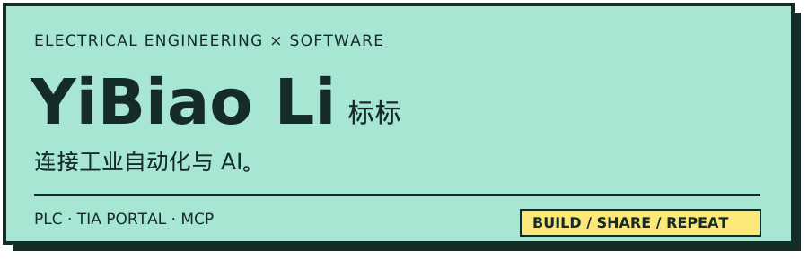
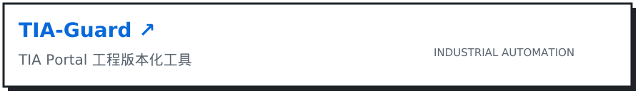
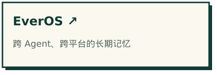
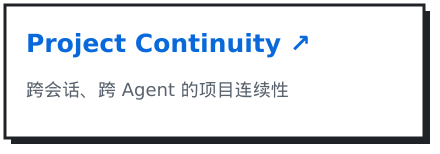

<!-- Profile artwork uses local SVG assets; no external stats service. -->

  <a href="https://github.com/biaobiao2233/tia-guard">
    <picture>
      <source media="(prefers-color-scheme: dark)" srcset="./assets/tia-guard-dark.svg" />
      
    </picture>
  </a>

  <a href="https://github.com/biaobiao2233/EverOS">
    <picture>
      <source media="(prefers-color-scheme: dark)" srcset="./assets/everos-dark.svg" />
      
    </picture>
  </a>
  <a href="https://github.com/biaobiao2233/project-continuity">
    <picture>
      <source media="(prefers-color-scheme: dark)" srcset="./assets/project-continuity-dark.svg" />
      
    </picture>
  </a>

`C# / .NET` · `Python` · `S7-1200` · `Git`
