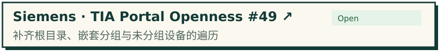
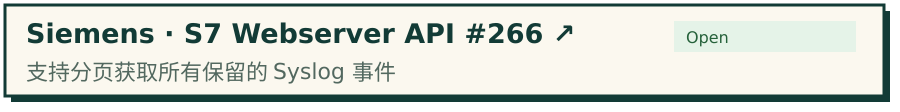
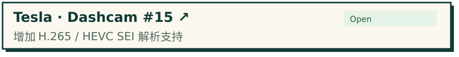
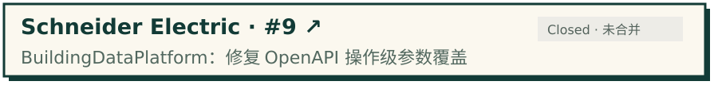
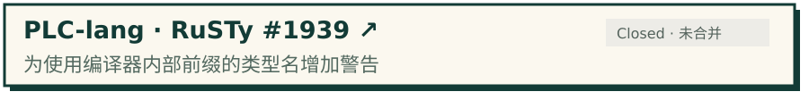

<!-- Profile artwork uses local SVG assets. PR states are a dated snapshot; linked PR pages are authoritative. -->
    <picture>
      <source media="(prefers-color-scheme: dark)" srcset="./assets/banner-dark.svg" />
      
    </picture>

  <a href="https://biaobiao.space/">
    <picture>
      <source media="(prefers-color-scheme: dark)" srcset="./assets/website-dark.svg" />
      
    </picture>
  </a>
  <a href="https://github.com/search?q=is%3Apr+author%3Abiaobiao2233+-user%3Abiaobiao2233&amp;type=pullrequests">
    <picture>
      <source media="(prefers-color-scheme: dark)" srcset="./assets/external-prs-dark.svg" />
      
    </picture>
  </a>

    <picture>
      <source media="(prefers-color-scheme: dark)" srcset="./assets/projects-heading-dark.svg" />
      
    </picture>

  <a href="https://github.com/biaobiao2233/tia-guard">
    <picture>
      <source media="(prefers-color-scheme: dark)" srcset="./assets/tia-guard-dark.svg" />
      
    </picture>
  </a>

  <a href="https://github.com/biaobiao2233/EverOS">
    <picture>
      <source media="(prefers-color-scheme: dark)" srcset="./assets/everos-dark.svg" />
      
    </picture>
  </a>
  <a href="https://github.com/biaobiao2233/project-continuity">
    <picture>
      <source media="(prefers-color-scheme: dark)" srcset="./assets/project-continuity-dark.svg" />
      
    </picture>
  </a>

    <picture>
      <source media="(prefers-color-scheme: dark)" srcset="./assets/contributions-heading-dark.svg" />
      
    </picture>

  <a href="https://github.com/siemens/tia-portal-openness-code-snippets/pull/49">
    <picture>
      <source media="(prefers-color-scheme: dark)" srcset="./assets/pr-siemens-openness-dark.svg" />
      
    </picture>
  </a>

  <a href="https://github.com/siemens/simatic-s7-webserver-api/pull/266">
    <picture>
      <source media="(prefers-color-scheme: dark)" srcset="./assets/pr-siemens-syslog-dark.svg" />
      
    </picture>
  </a>

  <a href="https://github.com/Beckhoff/ADS/pull/312">
    <picture>
      <source media="(prefers-color-scheme: dark)" srcset="./assets/pr-beckhoff-ads-dark.svg" />
      
    </picture>
  </a>

  <a href="https://github.com/teslamotors/dashcam/pull/15">
    <picture>
      <source media="(prefers-color-scheme: dark)" srcset="./assets/pr-tesla-dashcam-dark.svg" />
      
    </picture>
  </a>

  <a href="https://github.com/SchneiderElectricBuildings/BuildingDataPlatform/pull/9">
    <picture>
      <source media="(prefers-color-scheme: dark)" srcset="./assets/pr-schneider-openapi-dark.svg" />
      
    </picture>
  </a>

  <a href="https://github.com/PLC-lang/rusty/pull/1939">
    <picture>
      <source media="(prefers-color-scheme: dark)" srcset="./assets/pr-rusty-types-dark.svg" />
      
    </picture>
  </a>

PR 状态核对于 **2026-09-30**，最新状态以 PR 页面为准。

[查看全部外部 PR ↗](https://github.com/search?q=is%3Apr+author%3Abiaobiao2233+-user%3Abiaobiao2233&type=pullrequests) · [个人网站 ↗](https://biaobiao.space/)

`C# / .NET` · `Python` · `S7-1200` · `Git`
