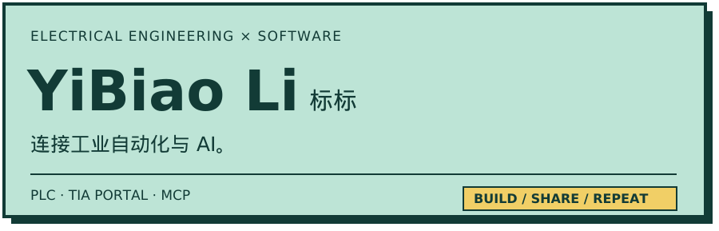
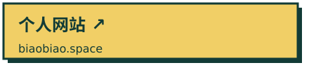

<!-- Profile artwork uses local SVG assets. Keep block-level HTML unindented so Markdown does not treat it as code. -->

<picture><source media="(prefers-color-scheme: dark)" srcset="./assets/banner-dark.svg" /></picture>

<a href="https://biaobiao.space/"><picture><source media="(prefers-color-scheme: dark)" srcset="./assets/website-dark.svg" /></picture></a>
<a href="https://github.com/search?q=is%3Apr+author%3Abiaobiao2233+-user%3Abiaobiao2233&amp;type=pullrequests"><picture><source media="(prefers-color-scheme: dark)" srcset="./assets/external-prs-dark.svg" /></picture></a>

<picture><source media="(prefers-color-scheme: dark)" srcset="./assets/projects-heading-dark.svg" /></picture>

<a href="https://github.com/biaobiao2233/tia-guard"><picture><source media="(prefers-color-scheme: dark)" srcset="./assets/tia-guard-dark.svg" /></picture></a>

<a href="https://github.com/biaobiao2233/EverOS"><picture><source media="(prefers-color-scheme: dark)" srcset="./assets/everos-dark.svg" /></picture></a>
<a href="https://github.com/biaobiao2233/project-continuity"><picture><source media="(prefers-color-scheme: dark)" srcset="./assets/project-continuity-dark.svg" /></picture></a>

`C# / .NET` · `Python` · `S7-1200` · `Git`
